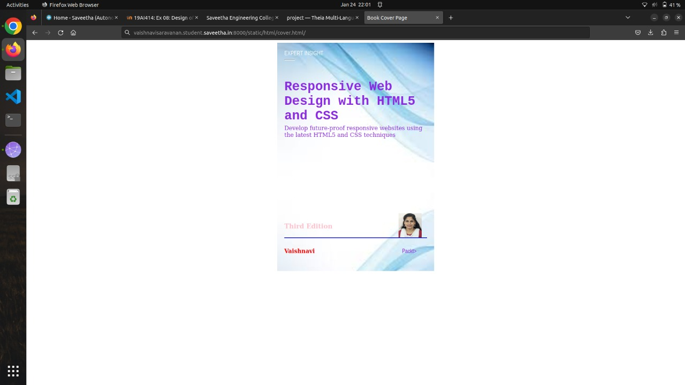

### cover-page-design

### AIM:
To Design the following book cover page using HTML and CSS: AIM:

To develop a website to display the cover page design of a book

###
Design Steps:

### Step 1:

Create a new Django project and app.

### Step 2:

Create a static file directory and mention the changes in settings.

### Step 3:

Make a new folder templates inside your app and create a html and map them using views and url.

### Step 4:

Write down the code for book cover using HTML and CSS.

### Step 5:

Add images and other contents using CSS record a screenshot of it.

### Code:

<!DOCTYPE html>
<html lang="en">
    <head>
        <meta name="viewport"
        content="width=device-width,initial-scale=1.0">
        
        <title>Book Cover Page</title>
    </head>
    <body>
        

            

                EXPERT INSIGHT
            

            

                

            

            

                <h1> Responsive Web Design with HTML5 and CSS </h1>

            

                Develop future-proof responsive websites using the latest  HTML5 and CSS techniques
            

            

                
            

            

                

            

            

                
<b>Pavithra</b>

            

            

                Packt>
            

            

                <b>Third Edition</b>
            

        

    </body>
</html>

### OUTPUT:

### RESULT:
The program for designing book cover page using HTML and CSS is executed successfully